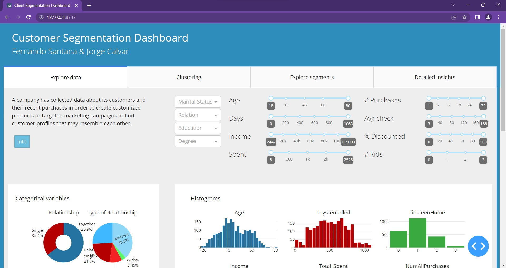
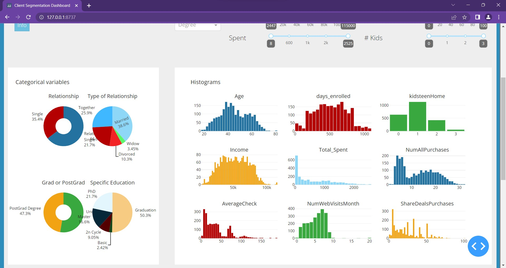
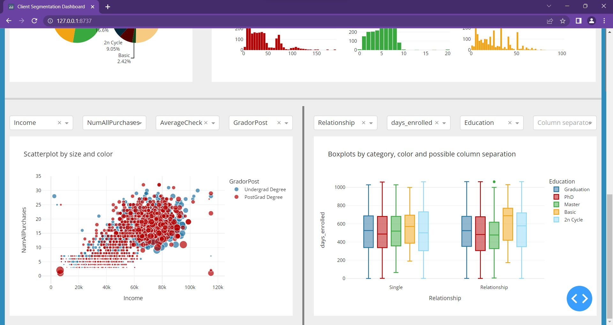
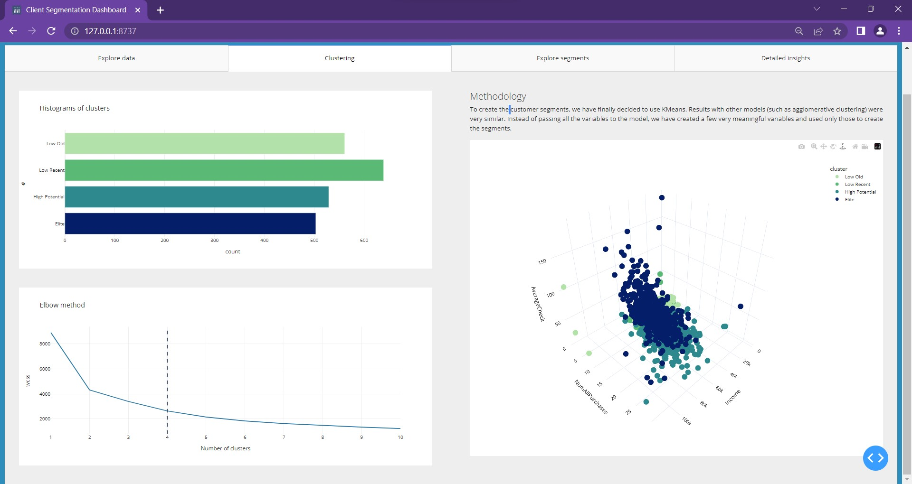
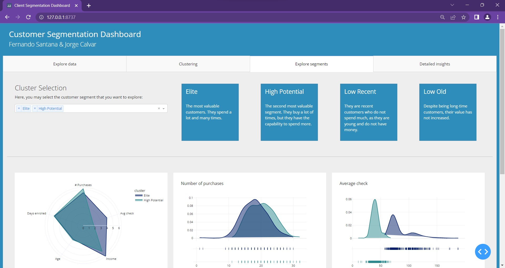
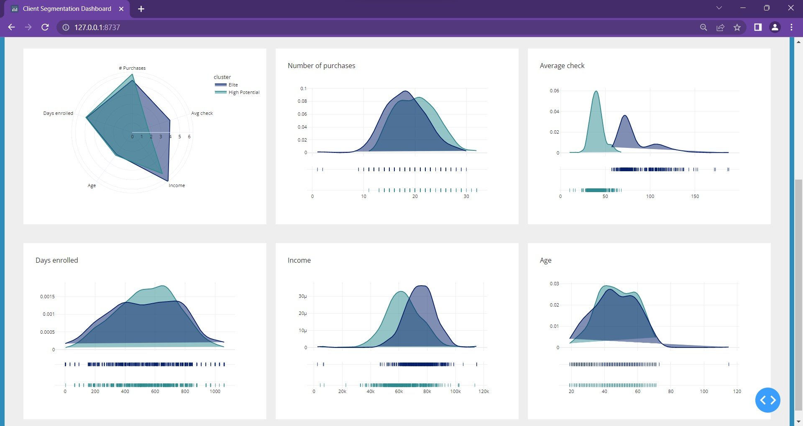
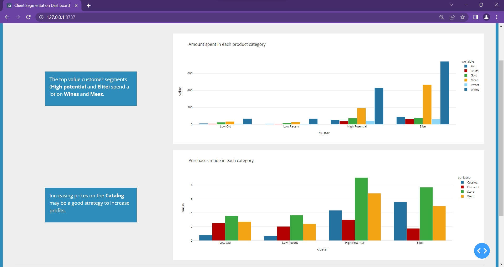
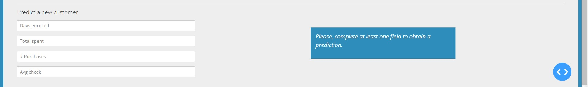
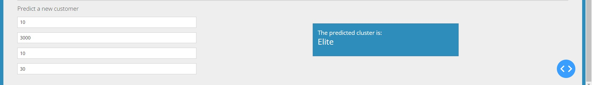

# Customer segmentation dashboard

This is the final project of the course Application Development for Data Visualization.
It is based on a dataset of customers. It contains sociodemographic information (age, education, income, etc), as
well as their consumption patterns (number of purchases, etc..).
The dashboard consists of 4 tabs:

### Tab 1: Data exploration

In this tab, we can observe the distribution of the variables and correlations between them.

We can filter each variable selecting a specific range.





There are also two graphs where we can select the specific variables to depict.




### Tab 2: Clustering technique

To cluster the customers, we have used KMeans, a simple clustering technique. We have only used a few 
meaningful variables to compute the clusters. Using the Elbow method, we decided that we would create
4 customer segments. 

Additionally, we have plotted a 3d graph representing 3 important variables. The color shows the customer 
segment. By changing the orientation of the graph, we observe that there are clear properties associated
with each cluster.





### Tab 3: Explore the created segments

In this tab, we present the four clusters, giving them meaningful names: Elite, High potential, Low old
and Low recent.

We may filter the clusters we want to compare, and observe the distributions for different variables.
The radar plot may give a general idea of which are the best ones and in which areas they excel.






### Tab 4: Other insights

Finally, in this tab, we observe some specific interesting insights about the clusters.

In the following image, we can see the products that each cluster consumes and how much. 
There is another graph showing the places where the customers buy, also by cluster.



We have also integrated a tool to predict the cluster to which a new customer belongs.
We just have to enter the value and receive the result.






<hr>

## How to run?

To execute the dashboard on your computer, run the following commands.

1. Clone and get in the project directory

````bash
git clone https://github.com/jorgecalvar/project-client-segmentation.git
cd project-client-segmentation
````

2. Create a virtualenv and install the requirements

````bash
python -m venv .venv
source .venv/bin/activate
pip install -r requirements.txt
````

3. Run the project

````bash
python app.py
````

